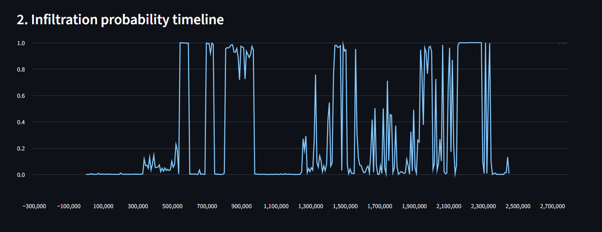
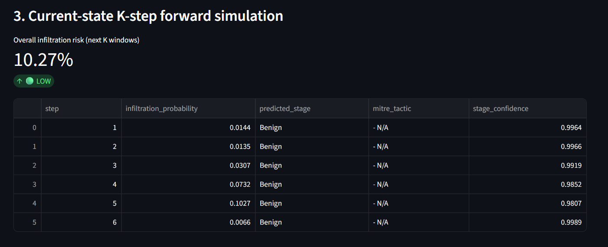
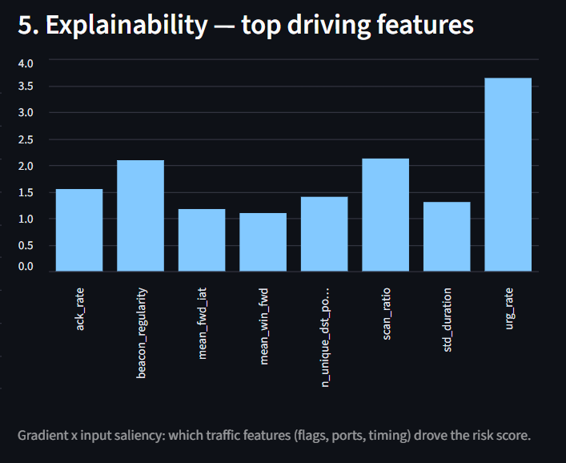

# NetForecast — AI World Model for Network Attack Forecasting

## 1. Project Information

- **Project Title:** NetForecast — AI World Model for Network Attack Forecasting
- **PS ID:** SIH26153
- **PS Title:** AI based Network Attack Forecasting from Network Traffic Data
- **Category:** Software
- **Organisation:** National Technical Research Organisation (NTRO)

## 2. Problem Statement & Proposed Solution

NetForecast learns the evolving state of a network from traffic telemetry and
forecasts the **probability and progression of an attack before compromise
completes**, mapping predicted behaviour onto MITRE ATT&CK stages, with
built-in explainability (attention weights + feature saliency/SHAP).

Unlike a static flow classifier (benign/malicious per flow), this is a
**World Model**: it learns the transition dynamics `P(S_t+1 | S_t)` of the
network state itself, then performs K-step forward rollout to simulate
where the current trajectory is heading.

---

## 3. Key Features

- Windowed flow + packet-level feature pipeline with engineered kill-chain
  signatures (scan ratio, beacon regularity, admin-port ratio, ...).
- LSTM **world model** that learns network-state transition dynamics,
  not just a per-flow label.
- K-step forward rollout — a forecasted infiltration-probability
  *trajectory*, plus predicted MITRE ATT&CK stage per step.
- Built-in explainability: attention weights + gradient×input saliency
  (and SHAP for the baseline).
- Offline Streamlit demo with real (CIC-IDS2017) and synthetic checkpoints.
- Benchmarked against a logistic-regression baseline on an identical,
  chronologically held-out test split (`reports/benchmark*.md`).

## 4. Technology Stack

- **ML / modelling:** PyTorch (LSTM world model), scikit-learn (baseline),
  SHAP (explainability)
- **Data:** pandas, NumPy, CIC-IDS2017 (real) + custom synthetic generator
- **Demo UI:** Streamlit
- **Language:** Python

## 5. Architecture at a glance

```
Flow records (CSV/PCAP)
        │
        ▼
Feature extraction (src/features.py)
  - flow-level: 5-tuple, TCP flags, byte/pkt counts, IAT stats
  - packet-level: TTL variance, window size, retransmissions, fragmentation
  - windowed (30s) aggregation → fixed-length state vector S_t
        │
        ▼
LSTM World Model (src/world_model.py)
  - Linear encoder → 2-layer LSTM → additive attention over context
  - 3 heads: next-state (dynamics regression), attack-stage (classification),
    infiltration probability (binary, K-step horizon)
        │
        ▼
Infiltration Prediction Engine (src/predict.py)
  - K-step autoregressive rollout (model's own prediction fed back as input)
  - MITRE ATT&CK stage mapping (src/mitre_mapping.py)
  - Explainability: attention weights + gradient×input saliency
        │
        ▼
Streamlit demo (demo/app.py) — offline, CSV in → probability timeline,
flagged flows, attack-stage annotations, explanations out
```

See [docs/architecture.md](docs/architecture.md) for the full write-up.

## 6. Repository Structure

```text
netforecast/
├── README.md
├── SUBMISSION_GUIDE.md
├── LICENSE
├── submission/
│   ├── PRESENTATION.md        # 5-slide technical presentation
│   └── DEMO.md                # 2-minute demo video script + link
├── docs/
│   └── architecture.md        # full architecture write-up
├── assets/
│   └── screenshots/           # demo screenshots
├── src/
│   ├── simulate_traffic.py    # synthetic CIC-IDS2018-schema flow generator (kill-chain campaigns)
│   ├── features.py            # flow → windowed state-vector pipeline
│   ├── dataset.py             # sequence windowing for supervised dynamics learning
│   ├── world_model.py         # LSTM + attention world model (PyTorch)
│   ├── train.py                # multi-task training (dynamics + stage + infiltration)
│   ├── baseline.py             # logistic-regression benchmark baseline
│   ├── evaluate.py             # F1/precision/recall/FPR benchmark, world model vs baseline
│   ├── predict.py              # K-step rollout + MITRE mapping + explainability
│   ├── explain.py              # SHAP explainability for the baseline
│   ├── real_data_adapter.py    # CIC-IDS2017 CSV -> pipeline schema adapter
│   └── mitre_mapping.py        # attack-stage ↔ MITRE ATT&CK tactic mapping
├── demo/app.py                 # Streamlit offline demo UI (switch real/synthetic in sidebar)
├── data/
│   ├── raw/                    # place the 8 CIC-IDS2017 daily CSVs here (git-ignored, large)
│   └── ...                     # generated/adapted flow CSVs (git-ignored, large)
├── models/                     # checkpoint trained on synthetic data
├── models_real/                 # checkpoint trained on real CIC-IDS2017 data
├── reports/                     # generated benchmark reports (synthetic + real)
└── requirements.txt
```

### What goes where?

| Item | Location |
|---|---|
| Source code | `src/`, `demo/` |
| Architecture / technical documentation | `docs/architecture.md` |
| Project screenshots | `assets/screenshots/` |
| Final presentation | `submission/PRESENTATION.md` |
| Demo video script + link | `submission/DEMO.md` |

## 7. Setup

```bash
cd netforecast
python -m venv .venv && source .venv/bin/activate   # or .venv\Scripts\activate on Windows
pip install -r requirements.txt
```

## 8. Reproduce end-to-end (training + benchmark)

```bash
# 1. Generate the labelled synthetic traffic dataset (kill-chain campaigns
#    interleaved with benign background traffic; ~24-48h of simulated flows)
python src/simulate_traffic.py --out data/synthetic_flows.csv \
       --n-benign 20000 --n-campaigns 15 --duration-hours 48

# 2. Train the LSTM world model (multi-task: dynamics + stage + infiltration)
python src/train.py --data data/synthetic_flows.csv --epochs 25

# 3. Train the logistic-regression baseline on the identical features/split
python src/baseline.py --data data/synthetic_flows.csv

# 4. Benchmark: F1 / precision / recall / FPR, world model vs baseline
python src/evaluate.py
# -> writes reports/benchmark.md

# 5. (optional) SHAP explanation of the baseline, for contrast
python src/explain.py
```

All scripts are deterministic (fixed seed 42) and the exact chronological
train/val/test split indices are cached in `models/split_indices.npz` so
`baseline.py` and `evaluate.py` compare against the *same* held-out,
future-in-time windows the world model never trained on.

## 9. Run the offline demo

```bash
streamlit run demo/app.py
```

Upload a flow-record CSV (or leave blank to use the bundled sample) and the
app will show:

1. Traffic overview (flow count, window count).
2. A rolling 1-step-ahead infiltration-probability timeline across the
   whole file.
3. A K-step forward simulation from the *current* (most recent) state:
   per-step infiltration probability + predicted MITRE ATT&CK stage.
4. Attention weights over the recent context window (explainability).
5. Top driving traffic features for the current risk score (gradient×input
   saliency).
6. The raw flows in the most recent time window, for analyst drill-down.

The app never calls out to the network or any cloud API — inference is a
local forward pass through the checkpoint in `models/`.







More screenshots (traffic overview, live replay, flagged flows, MITRE
stage reference) are in [assets/screenshots/](assets/screenshots/).

## 10. Trained on the real CIC-IDS2017 dataset

The project ships a working adapter for **CIC-IDS2017** (the 8 daily
CICFlowMeter CSVs — e.g. Kaggle "Network Intrusion dataset (CIC-IDS-2017)"
by chethuhn), and a checkpoint trained on it lives in `models_real/`.

```bash
# 1. Put the 8 daily CSVs (Monday-WorkingHours.pcap_ISCX.csv, ... ) in data/raw/

# 2. Adapt them to the pipeline's schema + kill-chain label taxonomy
python src/real_data_adapter.py --raw-dir data/raw \
       --out data/cicids2017_processed.csv --window-flow-count 200
# -> writes data/cicids2017_processed.csv
#    and   data/cicids2017_processed.day_boundaries.json

# 3. Train (note --window-seconds here means "flows per window", see below)
python src/train.py --data data/cicids2017_processed.csv \
       --window-seconds 200 \
       --day-boundaries data/cicids2017_processed.day_boundaries.json \
       --out-dir models_real --epochs 25

# 4. Baseline + benchmark on the identical split
python src/baseline.py --data data/cicids2017_processed.csv \
       --model-dir models_real --window-seconds 200
python -c "import sys; sys.path.insert(0,'src'); import evaluate; \
  evaluate.main(model_dir='models_real', data_path='data/cicids2017_processed.csv', \
                report_path='reports/benchmark_cicids2017.md')"
```

**Results** (`reports/benchmark_cicids2017.md`), on a chronologically
held-out test split:

| Model | Precision | Recall | F1 | False Positive Rate |
|---|---|---|---|---|
| Logistic Regression (baseline) | 0.313 | 0.780 | 0.447 | 0.828 |
| **LSTM World Model** | **0.842** | 0.823 | **0.832** | **0.075** |

The world model's F1 is nearly double the baseline's, with an order of
magnitude fewer false positives — evidence that learning the traffic's
temporal dynamics, not just its per-window features, is what drives
reliable forecasting on real attack traffic. `demo/app.py`'s sidebar lets
you switch between this real-data checkpoint and the synthetic one.

### CIC-IDS2017 adapter — schema differences & how they were handled

This particular CSV export (see `src/real_data_adapter.py` docstring for
the full column mapping) does **not** include IP addresses, protocol,
wall-clock timestamps, or packet-level fields (TTL, retransmissions,
fragmentation) — only flow-level CICFlowMeter statistics and a `Label`
column. The adapter therefore:

- Uses row order (CICFlowMeter emits flows in completion order) as a
  chronology proxy, windowing by a fixed **flow count** (200) instead of
  wall-clock seconds — pass this value as `--window-seconds` downstream.
- Zero-fills the missing packet-level and IP-dependent features (they
  carry no signal here, but the model still learns from all flow-level
  dynamics: byte/packet counts, TCP flags, IAT statistics, ports).
- Maps `Label` values onto the 5 kill-chain stages the problem statement
  asks for: `PortScan`→Reconnaissance, `FTP/SSH-Patator`+`Web Attack *`+
  `Heartbleed`→Initial_Access, `Bot`→Command_And_Control,
  `Infiltration`→Lateral_Movement. **DoS/DDoS rows are dropped** (MITRE
  "Impact", not one of the 5 requested stages). CIC-IDS2017 has **no
  Exfiltration-labelled traffic**, so the model sees zero training
  examples for that stage on this dataset — a real dataset limitation,
  stated here rather than hidden.
- Splits train/val/test **within each day** and unions them
  (`dataset.day_aware_split`), because CIC-IDS2017 dedicates each day to
  one attack family — a single global chronological cut would put entire
  attack types (e.g. all Friday PortScan traffic) only in the test split
  with zero training exposure.

To plug in a different real dataset (CIC-IDS2018, CTU-13, CICIoT2023)
instead, write a similar small adapter following
`real_data_adapter.py`/`simulate_traffic.COLUMNS` as a template: rename
that dataset's columns to the schema in `simulate_traffic.COLUMNS`, derive
`label_stage` from its attack-timeline annotations, and (if it includes
PCAPs) join packet-level fields via **Scapy**/**PyShark** on the flow
5-tuple + time window.

## 11. Why a World Model instead of a classifier?

A per-flow classifier scores each flow independently and cannot express
"the last 10 minutes of scanning + this new SMB connection means lateral
movement is imminent." NetForecast instead:

- Represents the **whole monitored network's state** at each 30s window
  as a single vector (flow volumes, flag mixes, scan/beacon/exfil
  signatures — see `features.STATE_FEATURE_NAMES`).
- Learns **P(S_t+1 | S_t)** — i.e. it is trained to predict the *next*
  state vector, not just today's label — via an MSE dynamics loss plus
  auxiliary stage/infiltration heads sharing the same recurrent context.
- **Simulates forward** K steps by re-feeding its own predictions,
  producing a probability *trajectory*, not a single snapshot score.
- `reports/benchmark.md` quantifies the resulting gain over a
  logistic-regression baseline given the identical context window and
  forecast horizon.

## 12. Explainability

- **Attention weights** (`world_model.AdditiveAttention`) show which of
  the last L observed time windows the model weighted most heavily.
- **Gradient × input saliency** (`predict.InfiltrationPredictor._saliency`)
  ranks which of the ~30 traffic features (SYN rate, scan ratio, beacon
  regularity, TTL variance, admin-port ratio, …) drove a given
  infiltration score.
- **SHAP** (`explain.py`) is used on the logistic-regression baseline as
  an independent, model-agnostic cross-check of feature importance.

No prediction is surfaced without at least one of these attached — this
was a hard requirement in the problem statement.

## 13. Limitations / honesty notes

- The primary trained checkpoint (`models_real/`) is trained on the real
  **CIC-IDS2017** dataset (§10). A second checkpoint (`models/`) trained on
  a synthetic generator is also included, mainly as a controlled testbed
  during development (it covers Exfiltration, which CIC-IDS2017 lacks)
  and as a template for adapting a different real dataset. See §10 for the
  CIC-IDS2017-specific schema gaps (no IPs/timestamps/packet-level fields)
  and how the adapter handles each.
- The "network state" here is a single aggregated vector for the whole
  monitored segment per time window. A natural extension (noted in
  `docs/architecture.md`) is a per-host graph state with a GNN encoder for
  larger enterprise topologies.
- K-step rollout accumulates model error autoregressively, as in any
  latent-dynamics/world-model rollout; `evaluate.py` reports metrics at
  the trained horizon K to keep this honest rather than cherry-picking
  short horizons.

## 14. Future Scope

- Per-host graph state with a GNN encoder for larger enterprise topologies
  (see [docs/architecture.md](docs/architecture.md) §7).
- Streaming ingest (Kafka/NetFlow collector feed) instead of CSV batch files.
- Adapters for additional real-world datasets (CIC-IDS2018, CTU-13, CICIoT2023).
