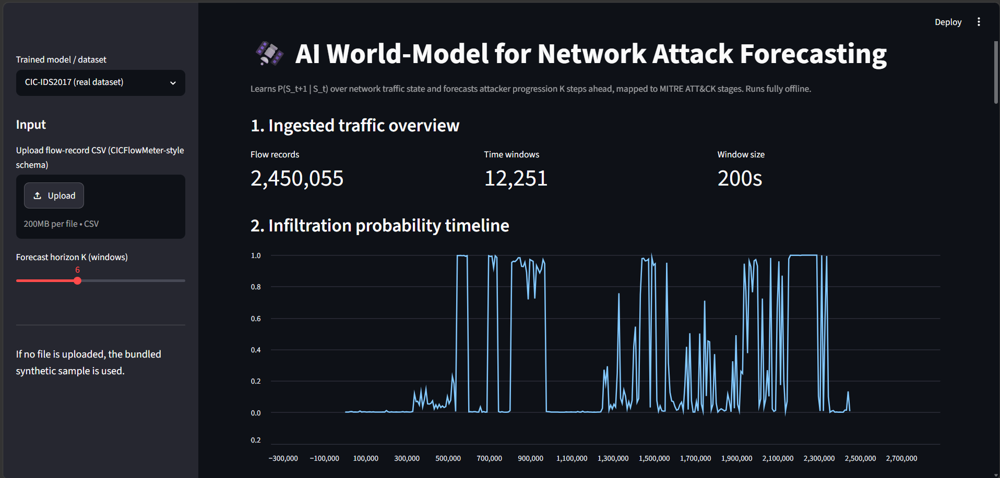
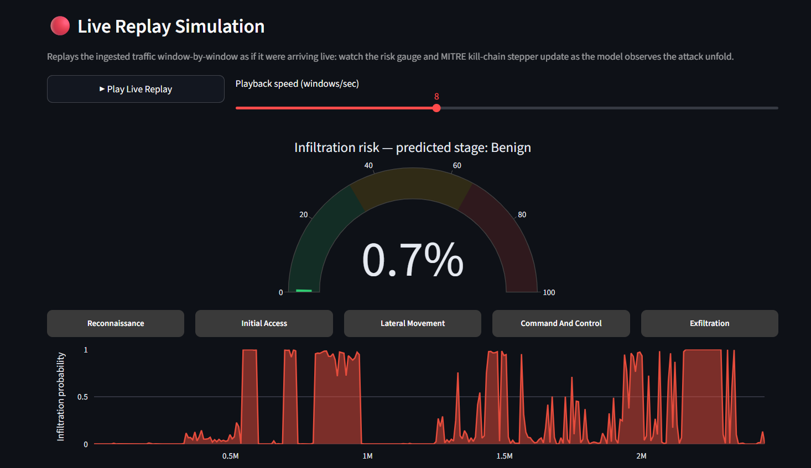
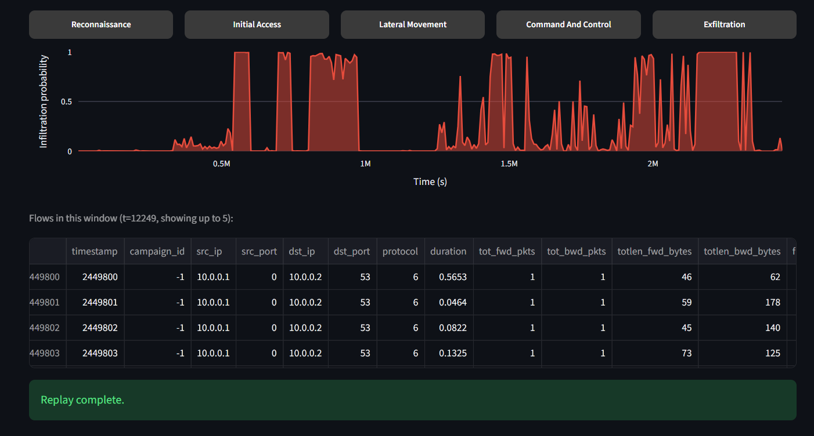
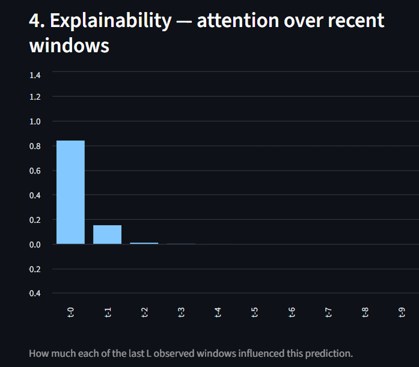
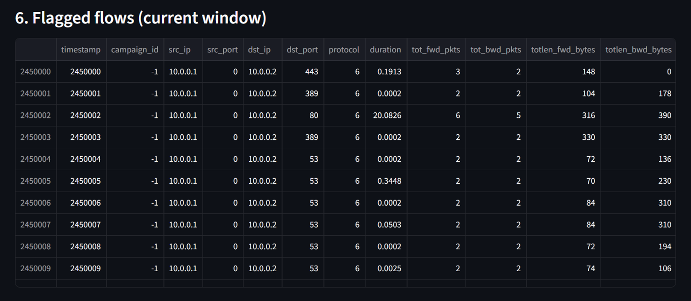
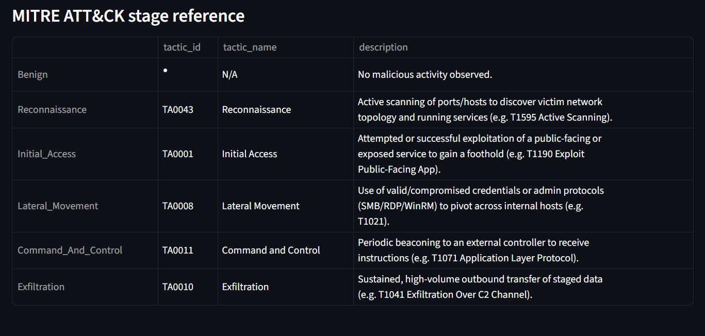

# Project Screenshots

Screenshots of the Streamlit demo (`streamlit run demo/app.py`, CIC-IDS2017 real-dataset checkpoint).

## 01-overview.png
Section 1 — Ingested traffic overview. Flow count, time-window count, and window size for the loaded file.

## 02-timeline.png
Section 2 — Rolling infiltration-probability timeline across the whole file. Each spike corresponds to a real attack campaign in the data.

## 03-live-replay-gauge.png
Live Replay Simulation — the risk gauge and MITRE kill-chain stepper updating window-by-window, as if the traffic were arriving live.

## 04-live-replay-result.png
Live Replay Simulation — completed run: the probability-over-time chart plus the raw flows in the final replayed window.

## 05-rollout.png
Section 3 — Current-state K-step forward simulation. Per-step infiltration probability, predicted MITRE stage, and confidence, K windows ahead.

## 06-attention.png
Section 4 — Explainability: attention weights over the last L observed time windows.

## 07-saliency.png
Section 5 — Explainability: top driving features (gradient×input saliency) behind the current risk score.

## 08-flagged-flows.png
Section 6 — Flagged flows in the current window, for analyst drill-down.

## 09-mitre-reference.png
MITRE ATT&CK stage reference — tactic IDs and descriptions for each of the 6 kill-chain stages the model predicts.

