# Project Screenshots

Captured from the NetForecast dashboard (`uvicorn server.main:app`), synthetic
campaign capture, 2× device scale.

Regenerate them all with the server running:

```bash
uvicorn server.main:app --port 8000
# then drive the page with your browser, or re-run the capture script used for these
```

## 00-dashboard.png
The full dashboard in one shot — stat tiles, risk gauge, kill-chain stepper,
probability timeline with replay controls, K-step forecast, explainability,
flow drill-down, live-ingest panel and the MITRE reference.

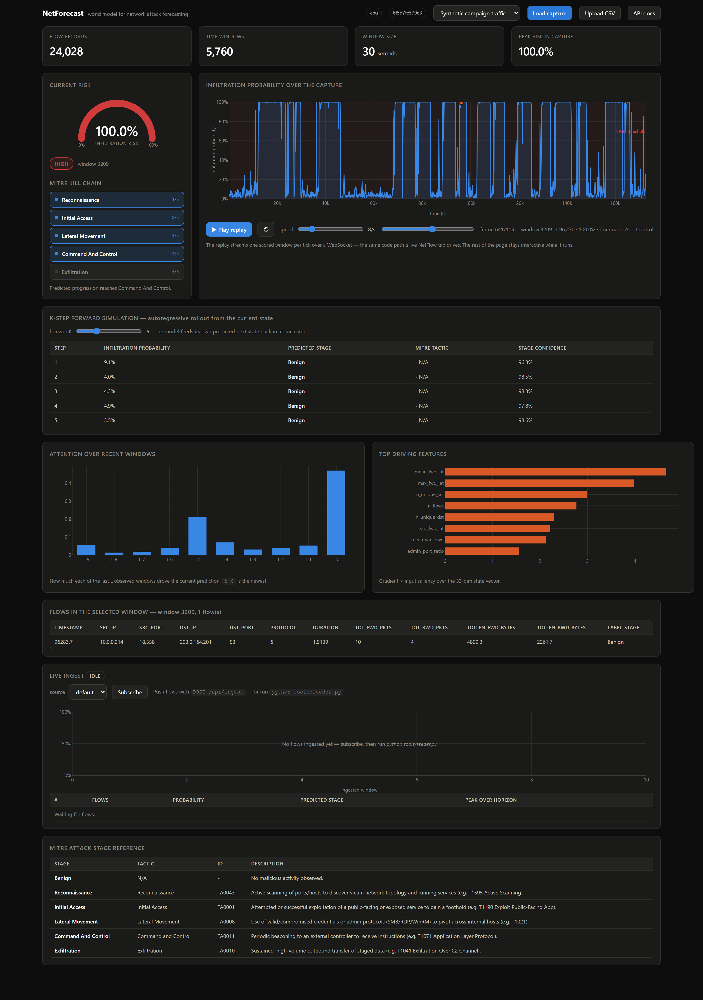

## 01-overview.png
Ingested-traffic tiles: flow count, window count, window size (labelled with its
real unit — seconds or flows) and peak risk across the capture.

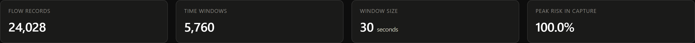

## 02-timeline.png
Infiltration probability across the whole capture, with the HIGH threshold
marked. Each plateau is a real attack campaign in the data.

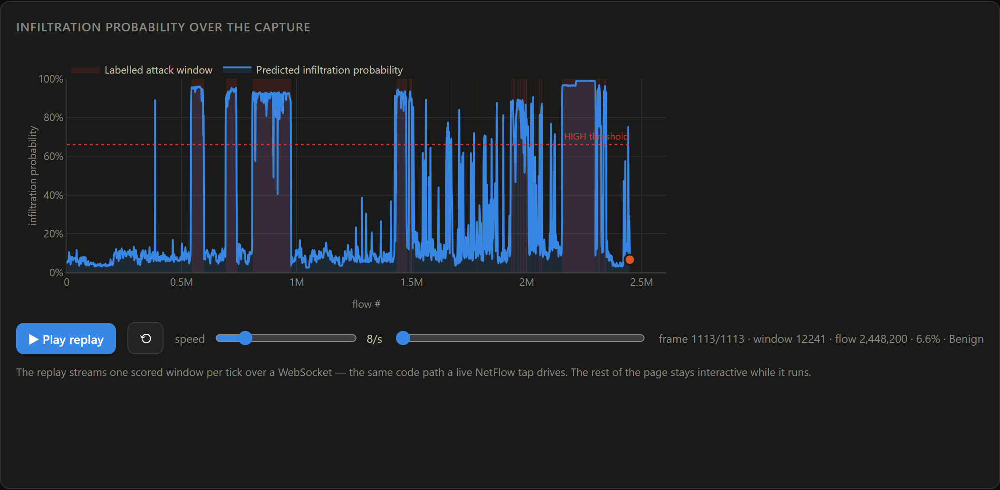

## 03-live-replay-gauge.png
Current risk gauge and the MITRE kill-chain stepper. The gauge bands are the
LOW/MEDIUM/HIGH status colours; the tick marks the HIGH threshold.

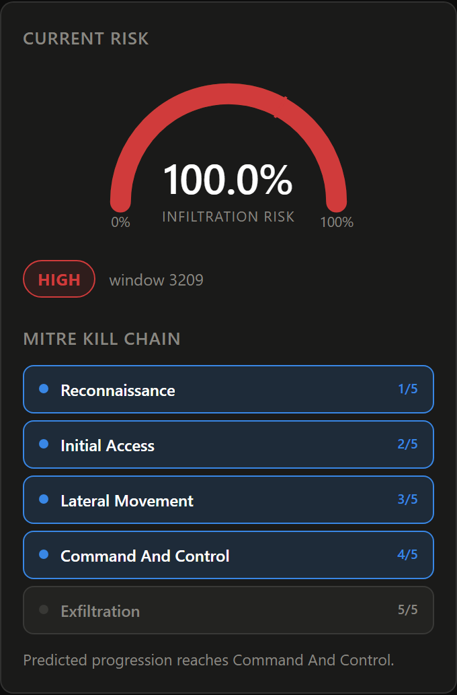

## 04-live-replay-result.png
Mid-replay. Windows stream over a WebSocket one per tick; the gauge, stepper,
timeline cursor and flow table all update while the rest of the page stays
interactive.

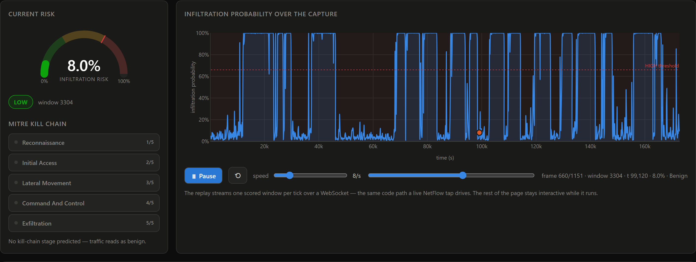

## 05-rollout.png
K-step forward simulation: the autoregressive rollout, per-step infiltration
probability, predicted MITRE stage and tactic, and stage confidence.

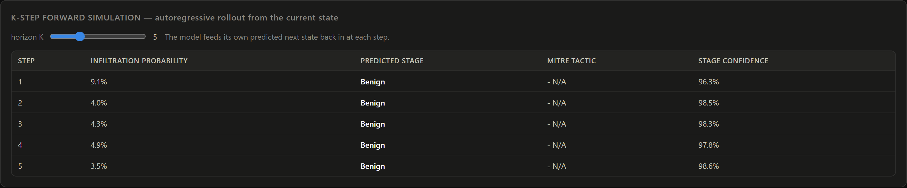

## 06-attention.png
Attention weights over the last L observed windows — which past windows drove
the current prediction.

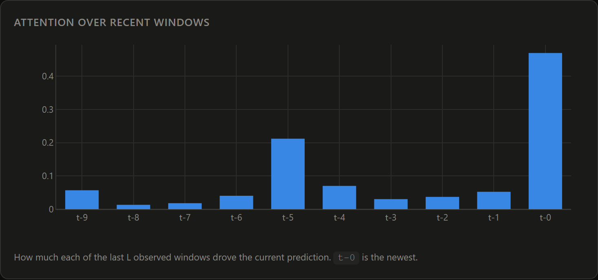

## 07-saliency.png
Gradient×input saliency over the 33-dim state vector — which traffic features
drove the risk score.

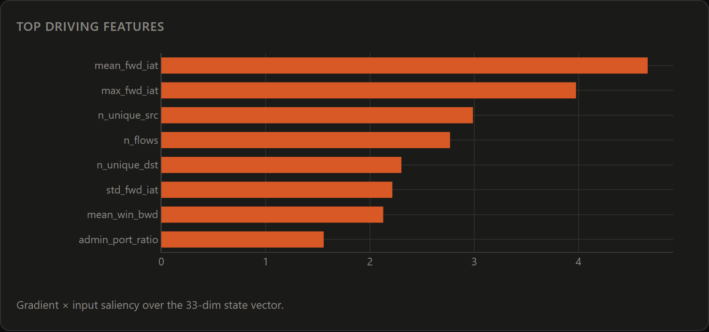

## 08-flagged-flows.png
Per-window flow drill-down for analyst inspection.

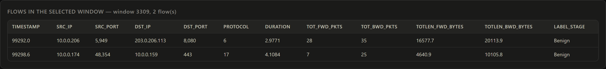

## 09-mitre-reference.png
The stage → MITRE ATT&CK tactic reference table served from `/api/mitre`.

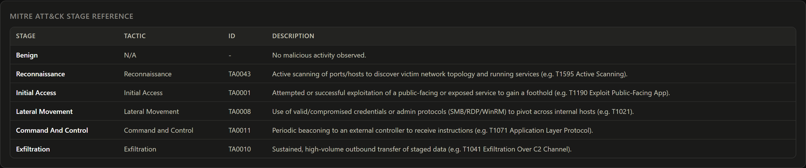

## 10-live-ingest.png
Live ingest: flow batches arriving over `POST /api/ingest` from an external
collector, windowed, scored and pushed to the dashboard in real time.

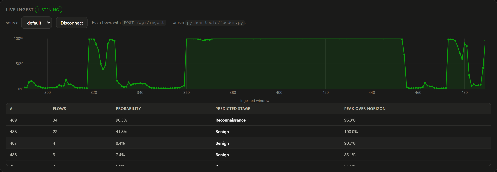
