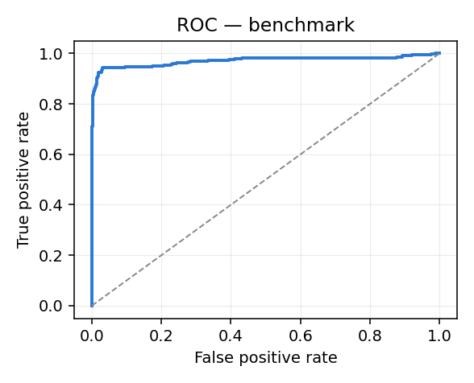
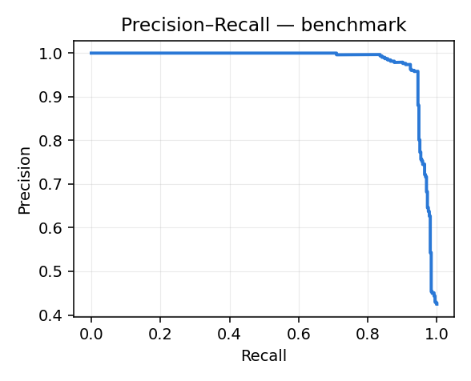

# Benchmark: World Model vs Baselines

Dataset: `data/synthetic_flows.csv` · model: `models` · held-out test anchors: **859** (positive rate 42.5%).

All numbers below come from frozen checkpoints; nothing here retrains the world model.

## 1. Single-shot detection

| Model | Precision | Recall | F1 | FPR | ROC-AUC | PR-AUC |
|---|---|---|---|---|---|---|
| Logistic Regression | 0.962 | 0.901 | 0.931 | 0.026 | 0.957 | 0.964 |
| Random Forest | 0.965 | 0.918 | 0.941 | 0.024 | 0.966 | 0.973 |
| **LSTM World Model** | 0.930 | 0.945 | **0.938** | 0.053 | 0.971 | 0.977 |

F1 improvement over the strongest baseline (Random Forest): **-0.004**

## 2. Operating point

Decision threshold is swept rather than fixed at 0.5. Best-F1 threshold on this split: **0.615** (F1 0.950 vs 0.938 at 0.5).

Note this threshold is selected on the test split, so treat it as an upper bound; a deployment would tune it on validation.

## 3. Forecast quality vs horizon (the world-model claim)

Step *s* is the model's **autoregressive rollout**: it has fed its own predicted state back in *s-1* times and has seen no new traffic. Scored against whether any malicious window actually occurs within *t+1 … t+s*.

| Horizon step | n | Positive rate | Precision | Recall | F1 | FPR | ROC-AUC |
|---|---|---|---|---|---|---|---|
| t+1 | 859 | 22.1% | 0.501 | 0.979 | 0.663 | 0.277 | 0.909 |
| t+2 | 859 | 33.8% | 0.784 | 0.966 | 0.866 | 0.135 | 0.903 |
| t+3 | 859 | 40.6% | 0.938 | 0.951 | 0.945 | 0.043 | 0.972 |
| t+4 | 859 | 41.7% | 0.957 | 0.925 | 0.940 | 0.030 | 0.966 |
| t+5 | 859 | 42.5% | 0.965 | 0.896 | 0.929 | 0.024 | 0.960 |

## 4. Lead time

Attack-episode onsets inside the evaluated test range: **100** (of 833 in the full capture). The model was already above the 0.62 threshold before onset in **96** of them (96%).

| Statistic | Windows of warning | Equivalent |
|---|---|---|
| Median (all onsets) | 2.0 | 60 seconds |
| Median (onsets warned) | 2.0 | 60 seconds |
| Mean | 1.6 | 49 seconds |
| p90 | 2.0 | 60 seconds |
| Max | 6.0 | 180 seconds |

Lead is measured against the *labelled* onset, so this is warning raised before the first malicious flow was recorded -- not merely before an analyst noticed.

## 5. Ablation — what the rollout costs

Both rows predict the **same label** (any malicious window in *t+1 … t+5*), so they are directly comparable. The difference is that the rollout has replaced 4 of its context updates with its *own* predicted states.

| Configuration | F1 | ROC-AUC |
|---|---|---|
| Single forward pass over observed context | 0.938 | 0.971 |
| 5-step autoregressive rollout | 0.929 | 0.960 |

The rollout retains **99%** of single-shot F1 while running 4 steps on self-generated state. That retention is the evidence the learned transition function is doing real work: a model that had only memorised a current-window mapping would degrade sharply once fed its own output.

The per-step table in section 3 uses a *cumulative* label (malicious anywhere in *t+1 … t+s*), so its positive rate rises with s and early steps are not comparable with later ones or with the table above.

## 6. Latency (CPU, single process)

| Operation | Median | p99 |
|---|---|---|
| Featurize 5k flows | 17.9 ms | – |
| Single forward pass | 0.88 ms | 1.93 ms |
| 5-step rollout | 4.24 ms | 5.03 ms |
| Rollout + explainability | 13.17 ms | – |

Everything runs offline on CPU — no GPU and no network call in the inference path.

## Curves

