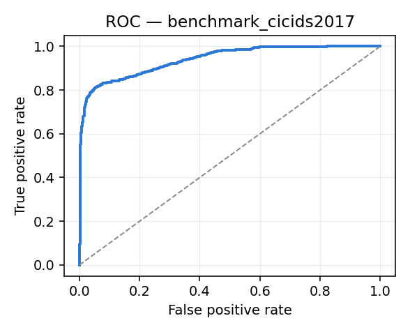
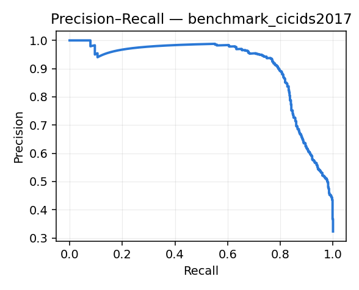

# Benchmark: World Model vs Baselines

Dataset: `data/cicids2017_processed.csv` · model: `models_real` · held-out test anchors: **1839** (positive rate 32.3%).

All numbers below come from frozen checkpoints; nothing here retrains the world model.

## 1. Single-shot detection

| Model | Precision | Recall | F1 | FPR | ROC-AUC | PR-AUC |
|---|---|---|---|---|---|---|
| Logistic Regression | 0.311 | 0.783 | 0.445 | 0.829 | 0.452 | 0.413 |
| Random Forest | 0.950 | 0.665 | 0.782 | 0.017 | 0.948 | 0.905 |
| **LSTM World Model** | 0.894 | 0.798 | **0.843** | 0.045 | 0.940 | 0.907 |

F1 improvement over the strongest baseline (Random Forest): **+0.061**

## 2. Operating point

Decision threshold is swept rather than fixed at 0.5. Best-F1 threshold on this split: **0.420** (F1 0.845 vs 0.843 at 0.5).

Note this threshold is selected on the test split, so treat it as an upper bound; a deployment would tune it on validation.

## 3. Forecast quality vs horizon (the world-model claim)

Step *s* is the model's **autoregressive rollout**: it has fed its own predicted state back in *s-1* times and has seen no new traffic. Scored against whether any malicious window actually occurs within *t+1 … t+s*.

| Horizon step | n | Positive rate | Precision | Recall | F1 | FPR | ROC-AUC |
|---|---|---|---|---|---|---|---|
| t+1 | 1839 | 27.6% | 0.830 | 0.868 | 0.849 | 0.068 | 0.953 |
| t+2 | 1839 | 29.7% | 0.833 | 0.848 | 0.841 | 0.072 | 0.946 |
| t+3 | 1839 | 31.0% | 0.805 | 0.825 | 0.815 | 0.090 | 0.936 |
| t+4 | 1839 | 31.7% | 0.765 | 0.825 | 0.794 | 0.118 | 0.929 |
| t+5 | 1839 | 32.3% | 0.736 | 0.818 | 0.775 | 0.140 | 0.923 |

## 4. Lead time

Attack-episode onsets inside the evaluated test range: **40** (of 227 in the full capture). The model was already above the 0.42 threshold before onset in **18** of them (45%).

| Statistic | Windows of warning | Equivalent |
|---|---|---|
| Median (all onsets) | 0.0 | 0 flows |
| Median (onsets warned) | 1.0 | 200 flows |
| Mean | 0.6 | 115 flows |
| p90 | 1.1 | 220 flows |
| Max | 3.0 | 600 flows |

Lead is measured against the *labelled* onset, so this is warning raised before the first malicious flow was recorded -- not merely before an analyst noticed.

## 5. Ablation — what the rollout costs

Both rows predict the **same label** (any malicious window in *t+1 … t+5*), so they are directly comparable. The difference is that the rollout has replaced 4 of its context updates with its *own* predicted states.

| Configuration | F1 | ROC-AUC |
|---|---|---|
| Single forward pass over observed context | 0.843 | 0.940 |
| 5-step autoregressive rollout | 0.775 | 0.923 |

The rollout retains **92%** of single-shot F1 while running 4 steps on self-generated state. That retention is the evidence the learned transition function is doing real work: a model that had only memorised a current-window mapping would degrade sharply once fed its own output.

The per-step table in section 3 uses a *cumulative* label (malicious anywhere in *t+1 … t+s*), so its positive rate rises with s and early steps are not comparable with later ones or with the table above.

## 6. Latency (CPU, single process)

| Operation | Median | p99 |
|---|---|---|
| Featurize 5k flows | 18.8 ms | – |
| Single forward pass | 3.01 ms | 4.34 ms |
| 5-step rollout | 9.12 ms | 17.84 ms |
| Rollout + explainability | 9.08 ms | – |

Everything runs offline on CPU — no GPU and no network call in the inference path.

## Curves

